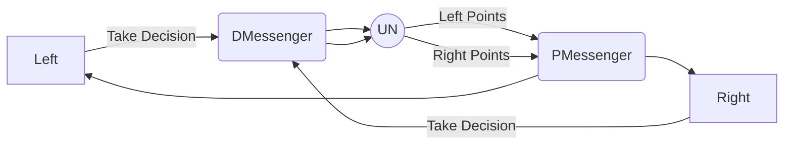

## Game Theory

## Points

|Decisions |Left Points |Right Points |
|----------|------------|-------------|
|`y` vs `y`|    `+3`    |     `+3`    |
|`y` vs `n`|    `+5`    |      `0`    |
|`n` vs `y`|    `0`     |     `+5`    |
|`n` vs `n`|    `+1`    |     `+1`    |